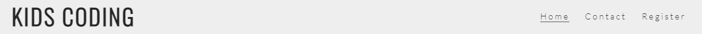
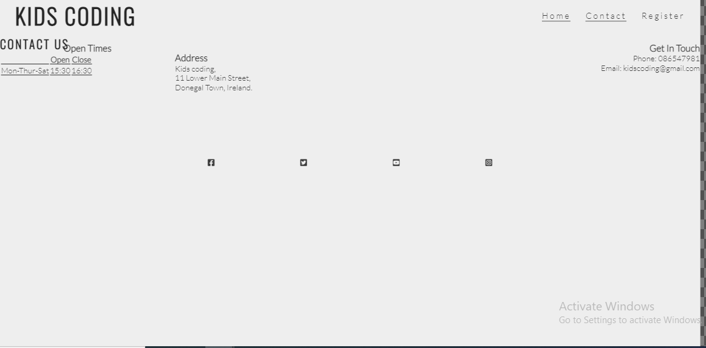
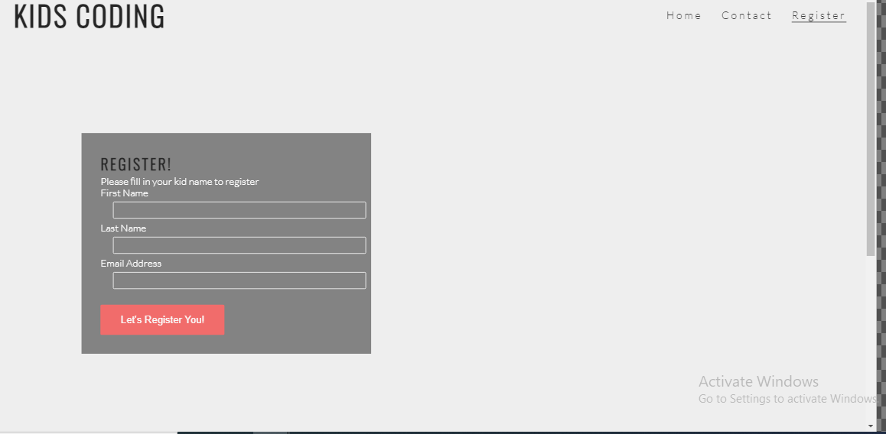
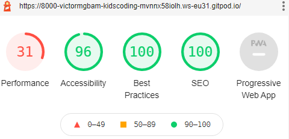

KIDS-CODING.

Kids coding website is about providing services of coding class to kids from 12 to 16 years.
Kids coding offers basic coding language ranging from basic HTML, CSS, and JavaScript.

Kids parent will be able to see when visiting kids coding website all the informations regarding
kids coding website, the languages kids coding offers, benifits of kids learnig coding at early formative
age of their children life's, and also see all the days of each coding classes on offer and time duration.
Kids coding website also show the contact page and register form.

<h1>DeskTop View</h1>

<h1>Tablet View</h1>

<h1>Smart Phone View</h1>

<h1>Features</h1>
 
   <h2>Navigation</h2>
      <ul>
       <li>At the top of the page shows the kids logo name on the left and the navigation on the right</li>
       <li>The navigation links are to the right, namely Home, Contact and Register links which direct users to different sections of the same page.</li>
       <li>The logo and navigation used the font family of oswald, sans-serif. The navigation when clicked hover and undeline.</li>
       <li>The navigation indicates to the user what page name thereby making it easier to navigate through the page links</li>
      </ul>

    

      

<h2>The Header</h2>
    <ul>
      <li>The header shows the name of the website-kids coding and navigation links and font family of oswald, sans-serif.</li>
      <li>The section shows the important of learning coding, the age group of kids from 12 to 16yrs.</li>
      <li>The section also gives information about the coding language provided and what kids coding website is all about.</li>
    </ul>

<h2>Contact Page</h2>
    <ul>
       <li>The contact page gives information about the opening times, the address and the phone, email address of kids coding website</li>
    </ul>

  

  <h2>Register form Page</h2>
      <ul>
        <li>The register page has a form to collect details from parents who wants their kids to learn coding.</li>
        <li>The register form shows different fields namely kids first name, last name and email address to be filled out by the parents.</li>
        <li>This register form is important because it makes it easier for parents to register their kids for coding class. </li>
      </ul>

   

   <h2>Manual Testing</h2>
      <ul>
        <li>
          I tested this page on microsoft edge, chrome and firefox. It works in these browsers.
        </li>
        <li>I can confirmed that the home page and register page is responsive using different screen sizes by using "Am I Responsive tool.</li>
        <li>The navigation, header, contact and the register page text are easy to read and understand.</li>
        <li>The register form works well. It requires entries of data in every field, will only accept format in the email field and register button works.</li>
      </ul>

  <h2>Bugs</h2>

  <h3>Unsolved Bugs</h3>
   <ul>
     <li>Kids coding contact page content is not responsive in some screen devices.</li>
     <li>The contact informations for kids coding contact page display incorrect.</li>
   </ul>  

<h2>Validator Testing using W3C Validator, Official Jigsaw and Accessibility(Lighthouse)</h2>

   <h3>HTML (Nu Html Checker)</h3>
     <ul><li>No errors were returned when passing through the official W3C validator.</li></ul>

  <h3>CSS</h3>
     <ul><li>No errors were returned when passing through official(Jigsaw) CSS validator.</li></ul> 

  <h3>Accessibility</h3>
     <ul>
      <li>The fonts, text and the colors used in kids coding website are easy to read by running through lighthouse but there are issues with accessibilty.</li>
     </ul>   

  

<h3>Unfixed Bugs</h3>
  <ul>
    <li>contact page contents, open times, address and email not displaying well.</li>
    <li>There are issues with accessibility</li>
  </ul>

<h3>Deployment</h3> 

  <ul><li>Kids coding website was diployed to Github pages. The steps taken:</li>
       <li>1.From Github, navigate to setting and click</li>
       <li>2. From the drop down menus, select master branch</li>
       <li>3. By selecting the master branch and adding the url is selected.</li>
       <li>4. Allowing gitHub 10minutes to allow page unpload to be completed by github.</li>
  </ul> 

