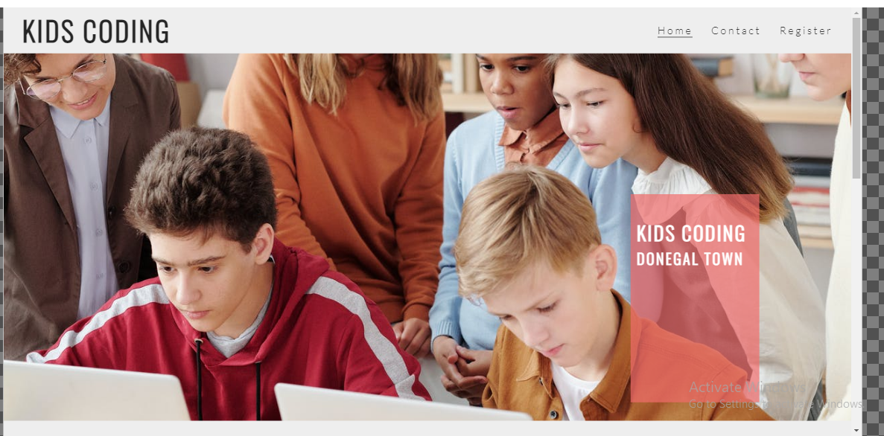
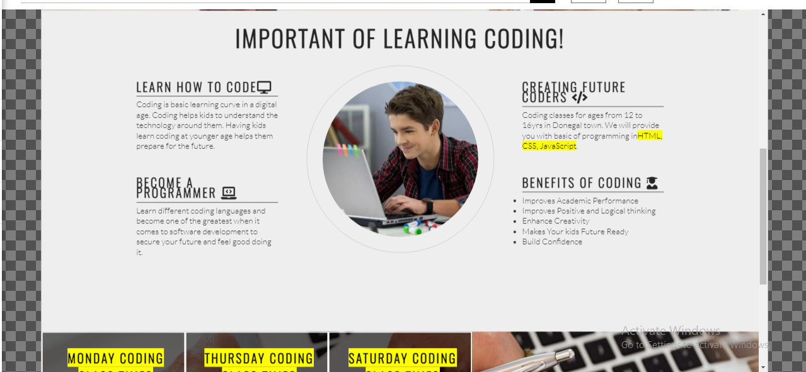
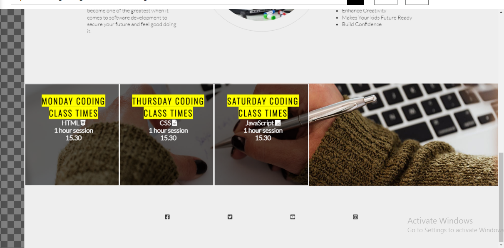
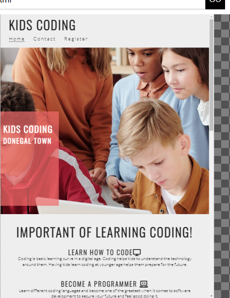
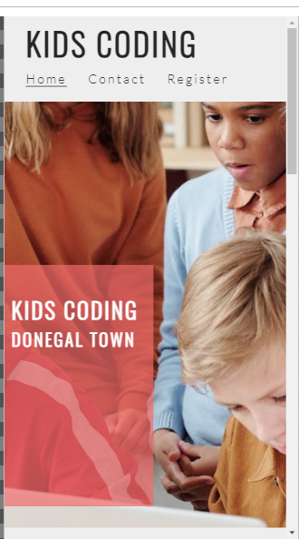

KIDS-CODING.

Kids coding website is about providing services of coding class to kids from 12 to 16 years.
Kids coding offers basic coding language ranging from basic HTML, CSS, and JavaScript.

Kids parent will be able to see when visiting kids coding website all the informations regarding
kids coding website, the languages kids coding offers, benifits of kids learnig coding at early formative
age of their children life's, and also see all the days of each coding classes on offer and time duration.
Kids coding website also show the contact page and register form.

<h1>DeskTop View</h1>

<h1>Tablet View</h1>

<h1>Smart Phone View</h1>

<h1>Features</h1>
 
   <h2>Navigation</h2>
      <ul>
       <li>At the top of the page shows the kids logo name on the left and the navigation on the right</li>
       <li>The navigation links are to the right, namely Home, Contact and Register links which direct users to different sections of the same page.</li>
       <li>The logo and navigation used the font family of oswald, sans-serif. The navigation when clicked hover and undeline.</li>
       <li>The navigation indicates to the user what page name thereby making easier to navigate through the page links</li>
      </ul>

